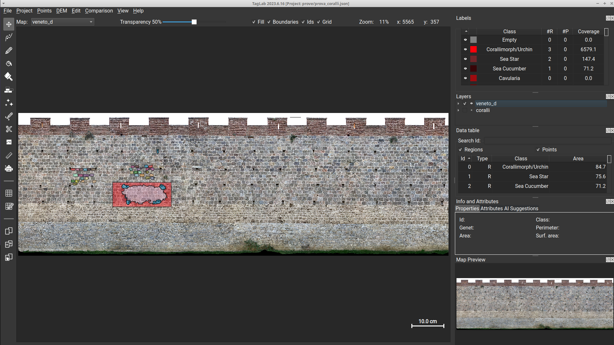

# TagLab: an image segmentation tool oriented to marine and masonry data analysis

| &nbsp; [Software Requirements](#software-requirements) &nbsp; | &nbsp; [Install](#installing-taglab) &nbsp; | &nbsp; [Update](#updating-taglab) &nbsp; | &nbsp; [Citation](#citation) &nbsp; |

TagLab was created to support the activity of annotation and extraction of statistical data from ortho-maps of benthic communities. The tool includes different types of CNN-based segmentation networks specially trained for agnostic (relative only to contours) or semantic (also related to species) recognition of corals. TagLab is an ongoing project of the Visual Computing Lab http://vcg.isti.cnr.it/.




## Interaction
TagLab allows to :

- zoom and navigate a large map using (zoom/mouse wheel, pan/'Move' tool selected + left button). With every other tool selected the pan is activated with ctrl + left button
- segment instances in a semi-automatic way by indicating the corals' extremes with the 4-clicks tool. This is achieved using the Deep Extreme Cut network fine-tuned on coral images. Deep Extreme Cut original code can be found here: https://github.com/scaelles/DEXTR-PyTorch
- segment  instances in a semi-automatic way by indicating the interior and the exterior of a coral using the positive-negative clicks tool. Use shift+left mouse button to assign the positive (the interior) points and shift+right mouse button to assign the negative (the exterior) points. This tool is based on the RITM interactive segmentation project, code and additional information can be found here: https://github.com/saic-vul/ritm_interactive_segmentation
- segment instances in a semi-automatic way using Segment Anything framework, additional information can be found here: https://github.com/facebookresearch/segment-anything
- apply watershed algorithm to segment wide areas
- use bricksSegmentation to segment single bricks inside wide areas
- assign a class with the 'Assign class' tool or double-clicking the class in the labels panel
- Area, perimeter and other information are displayed in the region info panel on the right
- simultaneously turn off the visibility of one or more classes, (ctrl + left button/disable all but the selected, shift + left button, inverse operation), change the class transparency using the above slider
- perform boolean operations between existing labels (right button to open the menu)
- refine the incorrect borders automatically with the Refine operation or manually with the 'Edit Border' tool
- tracking coral changes in different time intervals
- import depth information of the seafloor
- import GeoTiff
- draw internal cracks with the 'Create Crack' tool
- make freehand measurements or measure the distance between centroids (Ruler tool).
- save the annotations (as polygons) and import them into a new project
- export a CSV file table containing the data of each coral colony
- export a JPG file of a black background with totally opaque labels
- export shapefiles
- export a new dataset and train your network (!)

We are working hard to create a web site with detailed instructions about TagLab. Stay tuned(!)


## Software Requirements


TagLab runs on __Linux__, __Windows__, and __MacOS__. To run TagLab, the main requirement is just __64bit Python 3.11.x__.

GPU accelerated computations are not supported on MacOS and on any machine that has not an NVIDIA graphics card.
To use them, you'll need to install the __NVIDIA CUDA Toolkit__, versions  11.6, 11.8, 12.1 are supported.
If you don't have a NVida graphics card (or if you use MacOS), CPU will be used.

## Installing TagLab

### Passo 1: Prerequisiti 

Prima di installare TagLab, accertarsi di avere installato sul PC la versione a **64 bit di Python 3.11 e NVIDIA CUDA Toolkit**. CUDA non è disponibile su sistemi Mac, quindi si sconsiglia l’uso di TagLab sotto Mac (andrebbe in CPU, ossia con performance nettamente inferiori).  

**NVIDIA CUDA Toolkits links:** 

* [CUDA Toolkit 11.6](https://developer.nvidia.com/cuda-11-6-0-download-archive)<br>
* [CUDA Toolkit 11.8](https://developer.nvidia.com/cuda-11-8-0-download-archive)<br>
* [CUDA Toolkit 12.1](https://developer.nvidia.com/cuda-12-1-0-download-archive)<br>


**IMPORTANTE: Quando viene installato Python sotto Windows bisogna accertarsi che il PATH sia aggiunto al Sistema e che I limiti di lunghezza dei PATH siano disabilitati cliccando su Disable PATH Limit Length** (vedere screenshot successivi, tralasciare che si tratta di Python 3.8). 

<p align="center"">


</p>

E’ possible controllare le versioni sul proprio Sistema di Python o CUDA scrivendo nella shell comandi:  

```
python3 --version 

nvcc --version 
```
rispettivamente.  

**Windows**

Sotto Windows, bisogna installare anche il Visual Studio Redistributable ([link](https://learn.microsoft.com/en-us/cpp/windows/latest-supported-vc-redist?view=msvc-170)). 

**Linux**

Sotto Linux, non ci sono ulteriori requisiti addizionali.  

**MacOS**

Gli utenti MacOS, oltre a Python, devono installare HomeBrew ([link](https://brew.sh/)) e successivamente la libreria GDAL. 


### Passo 2: Clonare il repositorio di TagLab 

A questo punto è sufficiente clonare il repository di TagLab cliccando su "Clone or Download" e decomprimendo lo zip scaricato nella cartella in cui si vuole installare TagLab.  

### Passo 3: Finalizzare installazione   

Aprire un terminale, una shell 

Andare nella cartella dove e’ stato copiato TagLab 

Digitare il comando: 

```
python3 install.py 
```

oppure, sotto Windows: 

```
python.exe install.py 
```

Lo script install.py installera’ le librerie di python necessarie per il funzionamento di TagLab, e scarichera’ le reti nella cartella models. Se NVIDIA CUDA Toolkit non e’ supportato dalla propria macchina e’ possible effettuare l’installazione della versione cpu digitando: 

```
python3 install.py cpu 
```

oppure, sotto Windows: 

```
python.exe install.py cpu 
```

### Passo 4: Eseguire TagLab 

Nella shell, scrivere il commando: 

```
python3 TagLab.py 
```

oppure, sotto Windows: 

```
python.exe taglab.py 
```

Per testare se tutto funziona correttamente, provare ad aprire i progetti di esempio dentro la cartella “projects”. 

# Citation

If you use TagLab, please cite it.

```
@article{TagLab,
	author = {Pavoni, Gaia and Corsini, Massimiliano and Ponchio, Federico and Muntoni, Alessandro and Edwards, Clinton and Pedersen, Nicole and Sandin, Stuart and Cignoni, Paolo},
	title = {TagLab: AI-assisted annotation for the fast and accurate semantic segmentation of coral reef orthoimages},
	year = {2022},
	journal = {Journal of Field Robotics},
	volume = {39},
	number = {3},
	pages = {246 – 262},
	doi = {10.1002/rob.22049}
}
```
