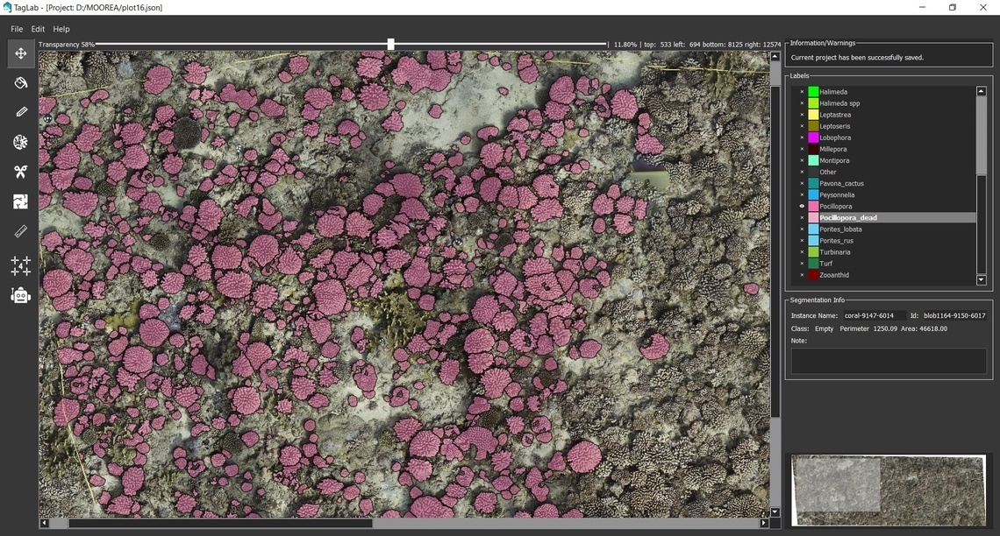

# TagLab: an image segmentation tool oriented to marine data analysis

| &nbsp; [Software Requirements](#software-requirements) &nbsp; | &nbsp; [Install](#installing-taglab) &nbsp; | &nbsp; [Update](#updating-taglab) &nbsp; | &nbsp; [Citation](#citation) &nbsp; |

TagLab was created to support the activity of annotation and extraction of statistical data from ortho-maps of benthic communities. The tool includes different types of CNN-based segmentation networks specially trained for agnostic (relative only to contours) or semantic (also related to species) recognition of corals. TagLab is an ongoing project of the Visual Computing Lab http://vcg.isti.cnr.it/.




## Interaction
TagLab allows to :

- zoom and navigate a large map using (zoom/mouse wheel, pan/'Move' tool selected + left button). With every other tool selected the pan is activated with ctrl + left button
- segment coral instances in a semi-automatic way by indicating the corals' extremes with the 4-clicks tool. This is achieved using the Deep Extreme Cut network fine-tuned on coral images. Deep Extreme Cut original code can be found here: https://github.com/scaelles/DEXTR-PyTorch
- segment coral instances in a semi-automatic way by indicating the interior and the exterior of a coral using the positive-negative clicks tool. Use shift+left mouse button to assign the positive (the interior) points and shift+right mouse button to assign the negative (the exterior) points. This tool is based on the RITM interactive segmentation project, code and additional information can be found here: https://github.com/saic-vul/ritm_interactive_segmentation
- assign a class with the 'Assign class' tool or double-clicking the class in the labels panel
- Area, perimeter and other information are displayed in the region info panel on the right
- simultaneously turn off the visibility of one or more classes, (ctrl + left button/disable all but the selected, shift + left button, inverse operation), change the class transparency using the above slider
- perform boolean operations between existing labels (right button to open the menu)
- refine the incorrect borders automatically with the Refine operation or manually with the 'Edit Border' tool
- tracking coral changes in different time intervals
- import depth information of the seafloor
- import GeoTiff
- draw coral internal cracks with the 'Create Crack' tool
- make freehand measurements or measure the distance between centroids (Ruler tool).
- save the annotations (as polygons) and import them into a new project
- export a CSV file table containing the data of each coral colony
- export a JPG file of a black background with totally opaque labels
- export shapefiles
- export a new dataset and train your network (!)

We are working hard to create a web site with detailed instructions about TagLab. Stay tuned(!)


## Software Requirements


TagLab runs on __Linux__, __Windows__, and __MacOS__. To run TagLab, the main requirement is just __64bit Python 3.7.x, 3.8.x or 3.9.x__.

GPU accelerated computations are not supported on MacOS and on any machine that has not an NVIDIA graphics card.
To use them, you'll need to install the __NVIDIA CUDA Toolkit__, versions 9.2, 10.1, 10.2, 11.0, 11.1, 11.3 and 11.6 are supported.
If you don't have a NVida graphics card (or if you use MacOS), CPU will be used.

## Installing TagLab

See the instructions on the [wiki](https://github.com/cnr-isti-vclab/TagLab/wiki/Install-TagLab).

## Updating TagLab

If you already installed TagLab and you need to update to a new version, you can just run the `update.py` script from the terminal (be sure to be into the TagLab main folder, see step 2):

```
python3 update.py
```
or, on Windows:

```
python.exe update.py
```

The script will automatically update TagLab to the newest version available in this repository.

NOTE: If some package is missing, after an update, re-launch install.py .

### Updating from 0.2

If you are updating TagLab from 0.2 version, in order to download also the new networks, please run the `update.py` script twice:

```
python3 update.py
python3 update.py
```


# Citation

If you use TagLab, please cite it.

```
@article{TagLab,
	author = {Pavoni, Gaia and Corsini, Massimiliano and Ponchio, Federico and Muntoni, Alessandro and Edwards, Clinton and Pedersen, Nicole and Sandin, Stuart and Cignoni, Paolo},
	title = {TagLab: AI-assisted annotation for the fast and accurate semantic segmentation of coral reef orthoimages},
	year = {2022},
	journal = {Journal of Field Robotics},
	volume = {39},
	number = {3},
	pages = {246 – 262},
	doi = {10.1002/rob.22049}
}
```
