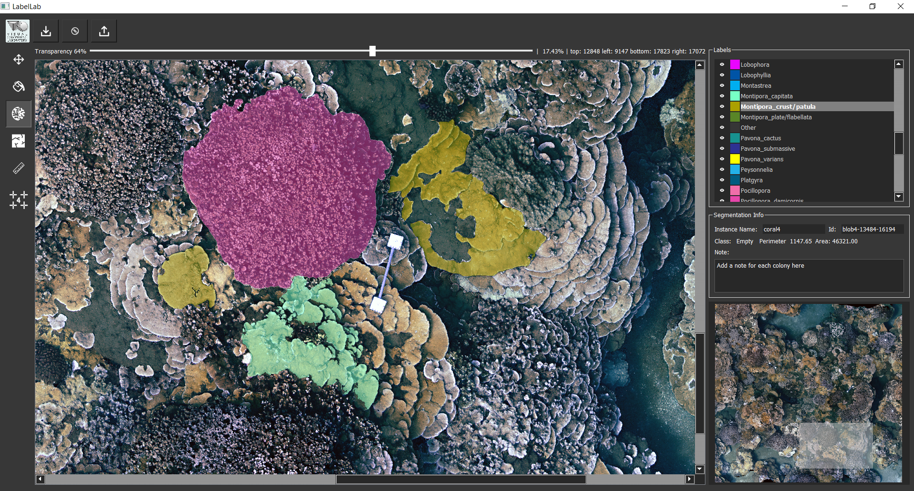

### LabelLab:  July 2019 Version 

LabelLab was created to support the activity of annotation and extraction of statistical data from ortho-maps of benthic communities. The tool includes different types of CNN-based segmentation networks specially trained for agnostic (relative only to contours) or semantic (also related to species) recognition of corals. LabelLab is an ongoing project of the Visual Computing Lab http://vcg.isti.cnr.it/.



  
### Interaction:
LabelLab allows you to :

- zoom and navigate a large map using a Map viewer
       -zoom/ mouse wheel
      - pan/ 'move' tool  selected + left button
       -with every other tool selected the pan is activated with ctrl + left button
- segment coral instances using the Deep Extreme Cut network fine-tuned on coral images.

Deep Extreme Cut original code : https://github.com/scaelles/DEXTR-PyTorch/

- assign a class with the 'Assign class' tool. Area and perimeter are now displayed in pixels (the scale can be added to transform measures in mm) in the segmentation info panel on the right.
- simultaneously turn off the visibility of one or more classes, (ctrl + left button/disable all but the selected, shift + left button, inverse operation), change the class transparency using the above slider.
- edit the incorrect edges with the 'Edit Border' tool.
- Draw coral internal cracks with the 'Create Crack' tool.
- Perform the boolean operation between labels: 'Merge Overlapped Labels', 'Divide Label', 'Subtract Label' (right button panel)
- make freehand measurements or measure the distance between centroids (Ruler tool).
- save the annotations (as polygons) and import them into a new project (Save Annotation, Load Annotation)
- Export a .csv file table containing the data of each coral colony.
- Export a .jpg file of a black background with totally opaque labels.


### Install LabelLab

To start a new project go to the Configuration.py file and fill the fields:
```sh
self.image_map_filename = "...\\MyFolderName\\MyFileName.png"
self.project_dir = "...\\MyFolderName\\MyProjectFolder
self.export_dir = "...\\MyFolderName\\MyExportFolder
```

##_Download the network weights http://vcg.isti.cnr.it/~cignoni/LabelLab/dextr_corals.pth and save the .pth file in the 'model' folder _ 

To add/delete a label name or change a RGB value go to Labels.py file and edit the dictionary: self.LABELS_LIST.
To lauch the tool simply launch LabelLab.py.


### Requirements: 

| Python Version: 3.6 - CUDA 10.0  |
|---|
|  pytorch 1.0.0  |
|   pyqt5 5.13.0|
|  scikit-image 0.15.0 |
|  scikit-learn 0.20.2 |
|  pandas 0.24.0 |
| scipy 1.2.0  |


 
### Future adjustment : Agust/September - 2019

- Optimization of the EditBorder tool (currently slow on large instances).
- Project initialization Interface (Map, scale, Folder, Global Coordinates).
- Management of different layers (comparison different years surveys).
- Weights of a more accurate Deep Extreme Segmentation network.
- Possibility to manage the registration of colonies with dead portions.
- Addition of a Semantic Segmentation Network.